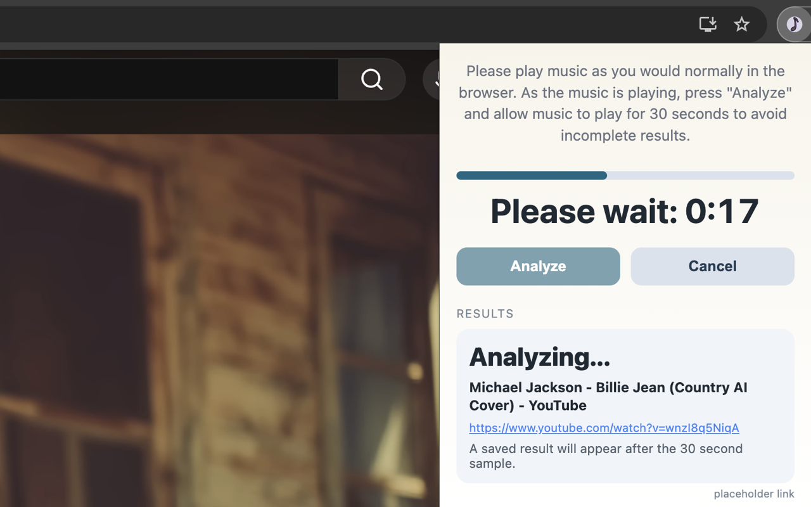
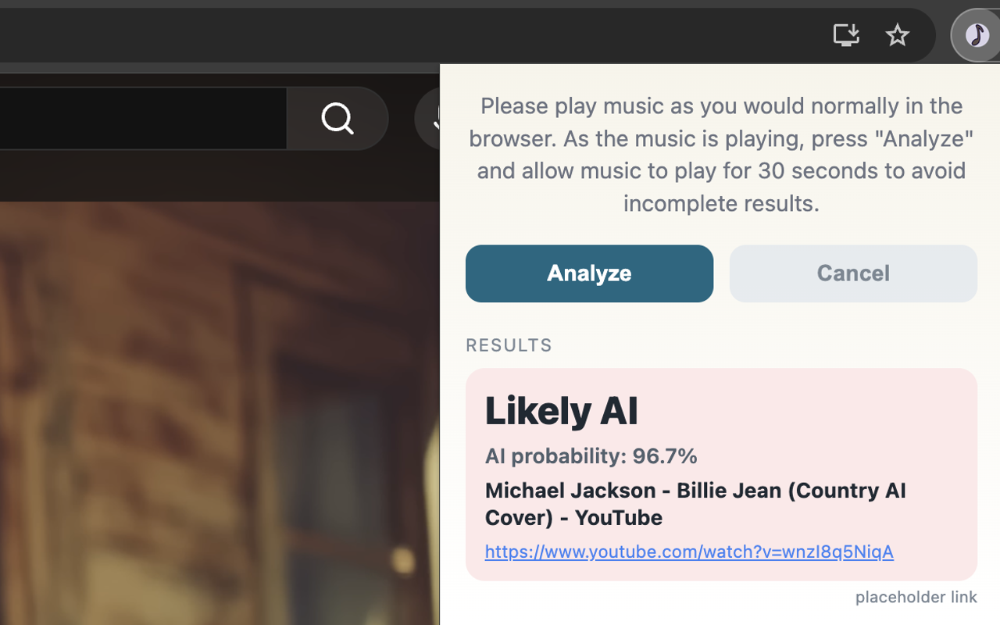
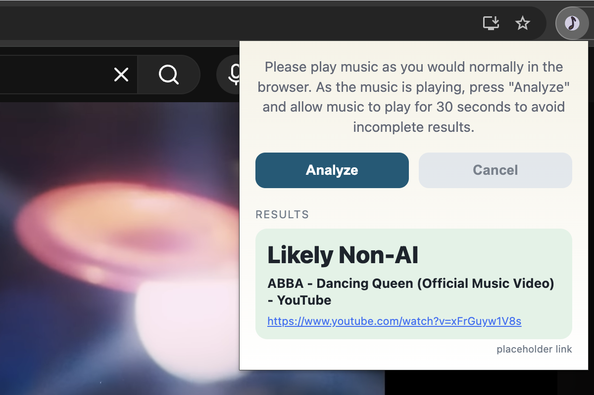

# Quicksilver Browser Extension

This is a browser extension that you can download from the [Google Chrome Extension Store](https://chromewebstore.google.com/detail/ikahnkjmdjoikhpcbpelagokjnkmpjdm?utm_source=item-share-cb) or [Microsft Edge Extension Store](https://microsoftedge.microsoft.com/addons/detail/quicksilver/hacidakkfmemkmkjlkleegmlajbnfoga), to quickly check if music you are listening to is AI-generated. This browser extension works by directly analyzing music audio from any online streaming source (YouTube, Spotify, Apple Music, ..., etc.) for artifacts music commonly found in AI-generated music. In other words, if your browser can play it, Quicksilver can directly classify the audio without you needing to download it or upload it anywhere. If you are looking for development setup, please look [here](#setup). If you are looking for our Mac app, please look [here](https://github.com/stanleykywu/quicksilver-macos).

## What is Quicksilver?

AI-generated music has grown incredibly quickly since 2024. Since then, our research has found that up to half of new songs uploaded to platforms like Spotify are now AI. Much of these AI songs are low quality, low effort AI music, with many even posing as legitimate, human musicians. In response, AI music detection has been proposed as a way to label and inform listeners on what songs are AI or not. However, as of this writing, the only place where AI songs are labeled this way is on the Deezer music streaming platform. While we believe this is a step in the right direction for AI transparency, we believe users should have access to the necessary tools to easily determine whether any given music is AI-generated or not, and not just that uploaded to certain platforms.

In an effort to address this, we have designed and implemented Quicksilver, a fast and low latency browser extension, which when given permission by the user, can analyze any audio from the browser (currently requiring 30 seconds), and quickly identify if it contains AI-generated music artifacts. Our detector is a lightweight machine learning model (only 37KB!) based on the [published results from Deezer’s research team](https://github.com/deezer/ismir25-ai-music-detector), which identified artifacts found in Suno/Udio songs. This was the best performing approach we found in our research.

Currently, our understanding is that almost all fully AI-generated songs are produced by either the Suno or Udio platform. As such, our model was trained with the goal of detecting Suno and Udio songs, while making sure non-AI songs are not mislabeled as AI (low false positive rate). Our current detector identifies AI songs 98% of the time and has a low false positive rate (<0.02%).

## How to use Quicksilver (+ Examples)
After you have installed Quicksilver through your browser's extension store, please read the following instructions on how to use Quicksilver and how to interpret its results.

### Using Quicksilver
Quicksilver directly analyzes the audio that comes from your browser. All you need to do is play music as you would normally, then click the "Analyze" button in the Quicksilver extension. After clicking "Analyze", please do not pause/reload the page, and allow the music to play for a full 30 seconds to avoid incomplete results. Please refer to the following screenshots for examples.

| | | |
|---|---|---|
| 
Analyzing audio
 | 
AI detected
 | 
AI not detected
 |
| 

 | 

 | 

 |

Notes:
* Your computer does not need to be unmuted for Quicksilver to analyze audio. However, the site in which you stream audio from should not be muted. Quicksilver will warn you if it detects a significant amount of silence in the analyzed audio.
* Feel free to click out of the Quicksilver extension while the countdown is ticking, it will continue to run in the background
* Results are saved for all websites you have already analyzed

### Interpreting Qucksilver Outputs
Quicksilver outputs binary results, i.e, it has two outputs: `Likely Non-AI` and `Likely AI`. `Likely AI` means that our model detected evidence of AI-generated artifacts in the music, and that the amount of evidence crossed a high enough threshold which we manually set. Likewise, an output of `Likely Non-AI` means that the model _did not_ find enough evidence of AI music for us to confidently say the song is AI. In other words, a `Non-AI` result **should not** be used as evidence that the provided music is human-made. 

For `Likely AI`, we also output the probability returned by our AI-music detector. This figure **should not** be interpreted as the percentage of the song that is AI. As we have mentioned earlier, Quicksilver is designed to identify **fully AI-generated songs**. This percentage is merely a confidence level of whether the song contains artifacts commonly assosciated with AI-generated songs.

### Quick Testing
If you would like to make sure Quicksilver is working correctly. Please test it on the following two YouTube videos:

[AI Music](https://www.youtube.com/watch?v=wnzI8q5NiqA)

[Human Music](https://www.youtube.com/watch?v=xFrGuyw1V8s)

## Limitations
1. Our model depends heavily on the AI songs it is trained on. Version 1.x is only trained to detect AI songs generated by Udio v1.5 and Suno v5. Songs generated by (potentially) newer versions of Suno/Udio may not be classified as AI. We will attempt to update our model if and when new versions are released.
2. Our model is not trained to detect open source models like DiffRhythm or ACE-Step. Based on our research paper, it does not seem like many people are using these models to generate and publish music (yet).
3. We do not claim our model is robust to audio augmentations. We are actively working to improve the robustness of our model, but we note here that motivated adversaries can intentionally edit their AI songs to avoid detection.
4. We are currently only able to develop Quicksilver for Google Chrome and Microsoft Edge. Browsers like Firefox and Safari lack the ability to grant browser extensions the permissions to analyze audio. If you prefer not to use Google Chrome or Microsoft Edge, we do offer a [MacOS app](.), which functions exactly the same as this extension, except it is also able to analyze any audio from your computer (not just Chrome).
 
## What makes Quicksilver different from online detectors like SubmitHub, Hive, …, etc.?
The goal of Quicksilver is to be fast, require as little effort as possible to use, and perform well. Quicksilver is based on an AI music detector that worked the best out of all other open source options. As such, instead of requiring users to first download music files, then upload to an online service, our detector directly analyzes music that is streamed online in your browser tab, and classifies it. Additionally, since the model is lightweight, it runs directly on your computer without needing the audio file to be sent anywhere. Finally, we open sourced our code on GitHub, and are always open to improvements, suggestions, and comments.

## Does Quicksilver work on audio deepfakes?
No. Our model is designed to detect Suno and Udio generated _music_. If the deepfake was created using one of those tools (i.e., using Suno to generate an AI song in the style of Michael Jackson), our model should be able to detect it. However, our model is not trained to detect pure speech generated by AI (like that of ElevenLabs), since those use different models other than Suno/Udio.

# Developing Quicksilver Browser Extension

This repo contains code for the Quicksilver browser extension, using Rust + WASM. Our code is composed of three modules:

1. Core Rust libraries for computing an audio sample's _fakeprint_, which are the features used to train our model, found under `src/core`
2. Python bindings for exporting the fakeprint computation as the Python package `fakepyrint`, found under `src/python`. These bindings are used for training the logistic regression used for inference in Python.
3. WebAssembly bindings for running end-to-end inference with the latest model, found under `src/web`.

Additionally, the `chromium/` folder contains the publicly available web extension. Note that by default, the WASM bindings are not included in the `chromium/` folder. To install the bindings, run `./scripts/build.sh web` from the root directory (see [Building Quicksilver](#building-quicksilver)).

We have provided a set of shell scripts to make it easy to contribute to Quicksilver. These scripts assume you have [Rust](https://rust-lang.org/tools/install/) (along with Cargo) and [uv](https://docs.astral.sh/uv/getting-started/installation/) already installed on your computer. uv is not needed if you don't plan on installing the Python bindings.

## Building Quicksilver

To build the core fakeprint libraries, run `./scripts/build.sh core`. 
To build the web exported inference package, run `./scripts/build.sh web`.
To build the Python bindings for model training, run `./scripts/build.sh python`
To build everything, run `./scripts/build.sh all`.

To install the browser extension, you can follow the guides for your respective browser. See guides for [Chrome](https://developer.chrome.com/docs/extensions/get-started/tutorial/hello-world#load-unpacked) and [Edge](https://learn.microsoft.com/en-us/microsoft-edge/extensions/getting-started/extension-sideloading). When choosing a file directory to load, choose `./chromium` as the directory.  

## Testing Quicksilver

To run unit tests for the core fakeprint modules, run `./tests/scripts/core.sh`.
To also run unit tests for the web module (including Chromedriver integration tests), run `./tests/scripts/web.sh`. 
To run unit tests for Fakepyrint, run `./tests/scripts/python.sh`.

We also provide two additional utilities for testing. 
  
`./tests/scripts/resample.sh` calls the standalone Rust executable in `src/bin/resample.rs`. Since resampling is a lossy operation, the easiest way to verify the resampling operation done in fakeprint computation is to listen to it. This provides a convenient script to produce resampled versions of input .WAV files for manual inspection.

`./tests/scripts/profile.sh` provides a script for performance profiling. The profiler uses [samply](https://crates.io/crates/samply) which conveniently requires zero external dependencies. If samply is not installed, the script will automatically install it. The profiled executable is `src/bin/profile.rs`. To profile the performance of the end-to-end inference, run `./tests/scripts/profile.sh web path/to/input.wav`. To profile just the fakeprint computation, run `./tests/scripts/profile.sh core path/to/input.wav`

## Fakepyrint

To compute the fakeprint from Python, we have provided convenient Python bindings around the core libraries, available as the locally installed package `fakepyrint` (install via `./scripts/build.sh python`). The package features two functions: `fakepyrint.compute_fakeprint` which computes the fakeprint of a flattened PCM audio array (an audio source with `M` channels and `N` samples should be interleaved as `[S_1_CH_1, ..., S_1_CH_M, ..., S_N_CH_1, S_N, CH_M]`) and `fakepyrint.compute_fakeprint_2d`, which computes the fakeprint of a PCM audio array of the form `[N;M]` where `N` is the audio samples and `M` is the channels. Example usage of the library can be found in `examples/fakeprint.py`.

## Building Custom Models

We provide a set of models that we trained ourselves in the `model/` folder. The web package utilizes the most recent of these models for inference. These models are trained using `sklearn.linear_model.LogisticRegression`, using Fakepyrint for feature extraction. The model is then converted to CBOR to be interoperable with Rust. 

If you would like to train your own model, we provide a serialization utility under `./scripts/serialize-model.py` that takes a pickle of a `sklearn.linear_model.LogisticRegression` and saves it as a CBOR. The path of `MODEL_BYTES` in `src/web/model.rs` can then be modified to point to the path of your custom model. To make it easier to generate quickly generate fakeprints from real audio sources for model training/testing, we also provide `./scripts/script-generate-fakeprints-multiprocessing.py`.
